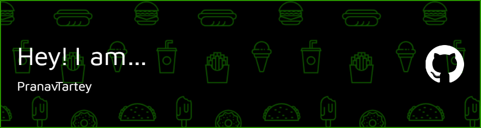

# Welcome to Pranav Tartey's GitHub Profile!

 <!-- Optional: Add a header image to personalize your profile -->

Hello, world! 👋 I'm Pranav Tartey, a Web Developer based in India. I'm passionate about Open Source Projects, and I enjoy solving problems through code.

## About Me

- 🔭 I’m currently working on Web Open Source projects.
- 🌱 I’m currently learning ReactJs.
- 💬 Ask me about Web Development and Version Control.
- 📫 How to reach me: pranavtartey@gmail.com
- 😄 Pronouns: He/Him

## My Projects

Here are some of the projects I'm proud of:

1. [React-Food-App](https://github.com/pranavtartey/ReactFoodApp) - This app is a good kick-start for a complete React newbie or to revise your core React concepts.
2. [BlogProject](https://github.com/pranavtartey/BlogProject) - As a NojeJs developer, I recently built a basic BlogPost CRUD Api web application using MongoDB and express.js, which allows users to create, read, update, and delete blog posts via a RESTful API. The API endpoints were tested and documented using Postman, ensuring that the application is scalable and reliable. With this project, I gained hand-on experience with Node.js, MongoDB, and Express.js, as well as proficiency in API design and testing using Postman.
This app will also help beginners to revise the core concepts of building a new web application using Node.js, MongoDB, and Express.js.
I am excited to continue working on similar projects and contribute to the growing field of web development.
3. [YelpCamp](https://github.com/pranavtartey/YelpCamp) - This is a Web Application that helps connect people from different region and allow them to share beautiful terrain which helps others to know the best spot to camp near them.

This also features a Map which further adds a precise location pin 📍 on the map so that a new user can effortlessly and efficiently find a perfect spot for themselves.

The authorities given to the user after registering on this app are basically :
i) He/She can post a new camping site 🏕(anywhere around the globe 🌏 ).
ii) He/She can edit or even delete permanently the post that they’ve made.
iii) He/She can comment on his/her own post as well as on the posts made by other users, and receive comments on his/her own post as well.
iv) A user is authorised only to delete his/her own comment from any post on the app, not even the owner of the post is allowed to delete the comments made by others.
v) A user can post multiple images for a single camp site.
Tech, framework, languages and apis, used for the making of this app are:
i) NodeJs (JavaScript runtime)
ii) MongoDB/MongoAtlas (Database)
iii) MapBox (Api)
iv) npm packages like -> ExpressJS, mongoose, passport etc.
v) JavaScript (primary language)
vi) Ejs (for dynamic templates and view engine)
vii) Mongo session store(for storing sessions)
viii) Cloudinary (api for image posting).
ix) BootStrap 3 (Front end).

You can find more of my projects on [My Repos](https://github.com/pranavtartey).

## My Tech Stack

I love working with various technologies and tools, including:

- Programming Languages: JavaScript and C++
- Web Development: NodeJs, MongoDB, ExpressJs, ReactJs
- DevOps: Git and GitHub

## Connect with Me
- LinkedIn: [My LinkedIn](https://www.linkedin.com/in/pranav-tartey-a7a95b213/)

Feel free to reach out, say hi, or collaborate on interesting projects. I'm always open to new opportunities and connections.

Thanks for visiting my GitHub profile! 😊
